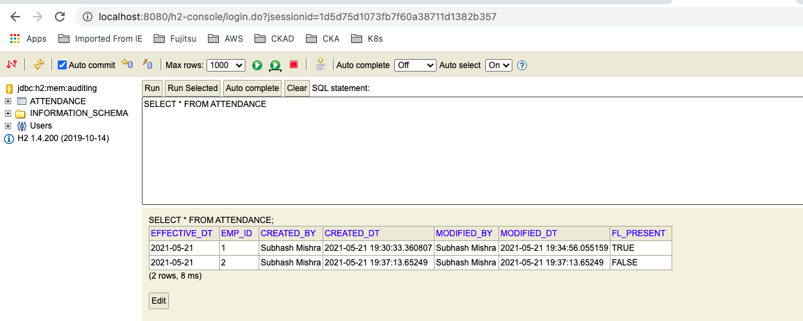

## What this APP does?
- Sample for how to implement auditing in microservices with spring data jpa, Use of EntityListners & SpringData jpa auditing
- @EntityListeners(value = { AuditingEntityListener.class })
   JPA entity listener to capture auditing information on persiting and updating entities.
- @EnableJpaAuditing 
   Annotation to enable auditing in JPA via annotation configuration.

### DB Screen


#### Input
```
{
	"empId": 2,
	"effectiveDt": "2021-05-21",
	"present": false
}
```

#### output
```
{
    "createdBy": "Subhash Mishra",
    "createdDt": "2021-05-21T19:37:13.65249",
    "modifiedBy": "Subhash Mishra",
    "modifiedDt": "2021-05-21T19:37:13.65249",
    "empId": 2,
    "effectiveDt": "2021-05-21",
    "present": false
}
```
